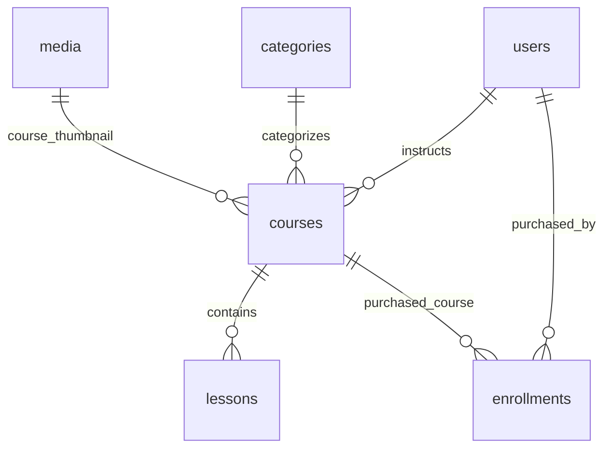

# 🎓 All About Tutor Space - Master Project Documentation

Welcome to **Tutor Space**, a high-performance, full-stack course selling and e-learning platform engineered using **Next.js 16 (App Router)** and **Payload CMS 3.x**. 

This document serves as the absolute **source of truth** and architectural blueprint for the entire project. It details the project's identity, technical stack, structural directories, custom design system, database engine, and step-by-step development guidelines.

---

## 🎨 Project Identity & Core Branding

**Tutor Space** is designed to look like a premium, state-of-the-art e-learning platform. It breaks away from generic color palettes and standard fonts, implementing a cohesive, modern dark-mode experience that builds user trust and boosts course conversions.

### 🎨 Color Palette & Aesthetic Tokens
The brand styling guidelines are defined locally inside the Tailwind v4 configurations:
- **🎛️ Primary Background:** `#121212` (Material Dark theme - deep, smooth, elegant, and modern background).
- **📝 Foreground Text:** `#ffffff` (Solid White - high contrast, readable typography).
- **⚡ Accent Brand Color:** `#615fff` (Vibrant Indigo-Neon Blue - used exclusively for interactive highlights, buttons, cards, and borders).

### ✍️ Typography Pairings
To achieve a premium, readable, and organic reading experience, we have imported Google Fonts natively via `next/font/google`:
1. **Plus Jakarta Sans (`--font-display`):** A modern, geometric display font. Used exclusively for brand logos, h1/h2/h3 headings, and track titles.
2. **Nunito (`--font-sans`):** A friendly, soft, rounded sans-serif font. Used globally as the default body typeface for articles, descriptions, user dashboards, and interface components.

---

## 🛠️ The Tech Stack

- **Core Framework:** Next.js 16.2.6 (React 19.2.4) utilizing React Server Components (RSC) and Server Actions.
- **Content Engine:** Payload CMS 3.84.1 (integrated natively—meaning the backend and administration panels run directly inside the same Next.js process).
- **Database Layer:** MongoDB powered by `@payloadcms/db-mongodb` (via `mongooseAdapter` for highly scalable document storing).
- **Styling Layer:** Tailwind CSS v4 (offering high-speed build processing and native CSS variable mappings).
- **Image Optimizer:** Sharp 0.34.5 (automatically compresses graphic assets and resizes uploads into responsive resolutions).
- **Package Manager:** pnpm 10.31.0 (for cached, superfast package installations).

---

## 🏗️ Folder Architecture & Isolated Boundaries

To keep the client-side styles and Next.js layouts isolated from the Payload Admin Panel, the codebase utilizes **Next.js Route Groups**:

```text
tutor-space/
├── app/
│   ├── (app)/                    # 🌐 PUBLIC FRONTEND WEBSITE
│   │   ├── globals.css           # Global CSS variables, Tailwind configurations & fonts
│   │   ├── layout.tsx            # Main HTML wrapper (loads Nunito & Plus Jakarta Sans)
│   │   └── page.tsx              # Tutor Space Landing Page (Now extremely modular)
│   │
│   └── (payload)/                # ⚙️ PAYLOAD CMS ADMIN & API GATEWAY
│       ├── admin/                # Catch-all routes for administrative panel
│       ├── api/                  # REST/GraphQL API catch-all endpoints
│       └── layout.tsx            # Isolated admin layout wrapping Payload's RootLayout
│
├── components/                   # 🧩 REUSABLE MODULAR UI COMPONENTS
│   ├── Navbar.tsx                # Glassmorphism Navbar with responsive drawer & auth dropdown
│   ├── Hero.tsx                  # Beautiful Hero landing section
│   ├── Stats.tsx                 # Platform stats banner
│   ├── Features.tsx              # Grid of feature highlight cards
│   ├── Courses.tsx               # Curated featured course cards
│   └── Footer.tsx                # Clean, structured site footer
│
├── collections/                  # 💾 MONGODB DATABASE COLLECTIONS SCHEMA
│   ├── Categories.ts             # Course categories schema
│   ├── Courses.ts                # Course listing with Pricing and Lexical rich text
│   ├── Enrollments.ts            # Sales, transactions, and student enrollment records
│   ├── Lessons.ts                # Course lessons, video streaming, and sorting indexes
│   ├── Media.ts                  # Media uploads compressed using Sharp
│   └── Users.ts                  # Admin, Instructors, and Student accounts registry
│
├── payload.config.ts             # Central Payload CMS configuration
├── tsconfig.json                 # TypeScript compiler mapping (includes @payload-config alias)
├── .env.local                    # Local environment secrets (ignored by Git)
└── README.md                     # Human developer overview
```

---

## 💾 Database Schema & Schema Registry (MongoDB)

All data is structured dynamically in a **MongoDB** database. The schema architecture contains 6 interconnected collections:



1. **Users (`users`):** Authentication collection. Roles include: `admin` (CMS editor), `instructor` (content creator), or `student` (course customer).
2. **Media (`media`):** Upload collection for graphic assets and slides. Powered by **Sharp**, it compresses uploads into `thumbnail` (400x300), `card` (800x600), and `hero` (1920x1080) responsive layouts.
3. **Categories (`categories`):** Groups course tracks (e.g. Development, Design, Databases).
4. **Courses (`courses`):** Stores course pages, pricing metrics, lexical rich text descriptions, instructor and category relations.
5. **Lessons (`lessons`):** Dynamic lessons attached to courses. Supports numerical sorting (`order` index) and video streaming links.
6. **Enrollments (`enrollments`):** Tracks student payments, transaction IDs, purchase status (`pending`, `completed`, `refunded`), and user course access.

---

## 🚀 Setting Up the Project Locally

Follow these quick steps to get the development engine running on your system:

### 1. Prerequisite Checks
Ensure you have Node.js (v20+) and **pnpm** installed globally:
```bash
npm install -g pnpm
```

### 2. Configure Environment Secrets
Create a `.env.local` file at the root of the project:
```env
# MongoDB Database URI (can be local mongodb:// or remote MongoDB Atlas)
DATABASE_URL=mongodb://127.0.0.1/tutor-space

# Unique security key used to sign Payload cookies and authentication tokens
PAYLOAD_SECRET=ba4c95208f237efb75e1136b8e3a242fce211bf439b1a5d0981b2c45e69e2c7a
```

### 3. Install Dependencies
Run the installation command to sync all packages:
```bash
pnpm install
```

### 4. Boot Up the Engine
Spin up the development server:
```bash
pnpm dev
```

### 5. Access Platforms
- **🌐 Tutor Space Landing Page:** [http://localhost:3000](http://localhost:3000)
- **🔑 CMS Admin Dashboard:** [http://localhost:3000/admin](http://localhost:3000/admin) (Sign up your first Admin user instantly)
- **🔌 REST API Gateway:** [http://localhost:3000/api](http://localhost:3000/api) (Query database collections)

---

## ⚠️ Important Developer Rules (For Human & AI Developers)

1. **Async Route Parameters (Next.js 16):**
   In this Next.js version, `params` and `searchParams` in layouts and pages are **Promises**. They must be treated as Promises.
   - **DO NOT** prematurely await `params` when passing them to Payload metadata generators or root page handlers. Pass them directly as Promises!
2. **Payload CMS Import Map:**
   Whenever you add or modify a collection structure, run `npx payload generate:importmap` to update the dynamically imported React admin panel components.
3. **Database Local API:**
   To fetch course listings on frontend server pages, do not use slow fetch requests to `/api/courses`. Fetch directly from the database level using the **Local API**:
   ```typescript
   import { getPayload } from 'payload'
   import configPromise from '@payload-config'

   const payload = await getPayload({ config: configPromise })
   const courses = await payload.find({ collection: 'courses' })
   ```
