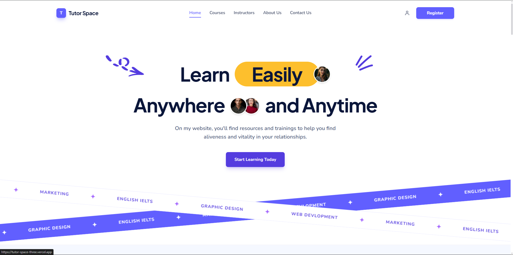

# 🎓 Tutor Space - Premium Course Selling Platform

Tutor Space is a high-performance, full-stack course selling and e-learning platform built natively on **Next.js 16 (App Router)** and **Payload CMS 3.x**. 

It provides completely isolated environments for public-facing client pages and administrative dashboards using Next.js Route Groups. It is designed for ultra-low latency server data fetching, robust role-based access controls, and modular course blueprint creation.

---

## 📸 Website Preview



---

## ✨ Features & Capabilities

- **🚀 Native Next.js 16 + React 19:** High-performance React Server Components (RSC) and server actions.
- **⚡ Payload CMS 3.x Native Integration:** No external backend needed—the administrative panel runs directly inside the same Next.js process.
- **📁 Modular Architecture:** Route groups (`(app)` and `(payload)`) completely isolate styling and page layout hierarchies.
- **💾 High-Performance MongoDB Database:** Scalable document-based database configuration for modern web loads.
- **🖼️ Automated High-Performance Uploads:** Integrates **Sharp** to automatically compress and optimize upload assets into multiple responsive resolution cards.
- **👤 Role-Based Registries:** Custom Users, Categories, Courses, Lessons, and payment-ready Enrollments schemas.
- **📦 Clean Package Management:** Switched fully to **pnpm** for ultra-fast, cached dependency execution.

---

## 🛠️ Technology Stack

- **Core Framework:** Next.js 16.2.6 & React 19.2.4
- **Headless CMS Engine:** Payload CMS 3.84.1
- **Database Layer:** MongoDB powered by `@payloadcms/db-mongodb`
- **Image Resizer:** Sharp 0.34.5
- **Style Processor:** Tailwind CSS v4
- **Package Manager:** pnpm 10.31.0

---

## 🔑 Demo & Test Login Credentials

Use the following credentials to test the various role access levels of the platform:

| Role | Email Login | Password | Description / Dashboard |
|---|---|---|---|
| **Admin** | `admin@tutorspace.com` | `123456` | Full administrative control under `/admin` |
| **Instructor** | `instractor@tutorspace.com` | `123456` | Manage courses, lessons, and content |
| **Staff** | `staf@tutorpsace.com` | `123456` | Staff/Moderator privileges |
| **Student** | `student@tutorpsace.com` | `123456` | Regular user learning & dashboard access |

---

## ⚙️ Environment Configuration (`.env.local`)

To run the project locally, create a `.env.local` file in the root directory and configure the following variables:

```env
# Database Configuration
DATABASE_URL=your_mongodb_connection_string

# Payload CMS Secrets
PAYLOAD_SECRET=your_payload_secret_key
ADMIN_REGISTRATION_SECRET=super-secret-admin-token-2026

# Email Provider Configuration (Resend)
RESEND_API_KEY=your_resend_api_key
RESEND_FROM_EMAIL=noreply@yourdomain.com

# Zoom Server-to-Server OAuth Credentials (Optional: Fill out to auto-generate Zoom links)
ZOOM_ACCOUNT_ID=your_zoom_account_id
ZOOM_CLIENT_ID=your_zoom_client_id
ZOOM_CLIENT_SECRET=your_zoom_client_secret
SECRET_TOKEN=your_zoom_secret_token

# Cloudflare R2 / S3 Storage Credentials (Optional: For remote file uploads instead of local storage)
S3_ENDPOINT=your_cloudflare_r2_endpoint
S3_BUCKET=your_s3_bucket_name
S3_ACCESS_KEY_ID=your_s3_access_key_id
S3_SECRET_ACCESS_KEY=your_s3_secret_access_key
```

---

## 🚀 Getting Started

### 1. Prerequisite Installations
Make sure you have Node.js and **pnpm** installed globally:
```bash
npm install -g pnpm
```

### 2. Install Project Dependencies
Run the following command to link all required Node packages:
```bash
pnpm install
```

### 3. Spin Up Development Server
Start the Next.js and Payload CMS local engine:
```bash
pnpm dev
```

### 4. Open Local Services
- **🌐 Public Frontend Website:** [http://localhost:3000](http://localhost:3000) (Edit pages inside `app/(app)/`)
- **🔑 Payload Admin Dashboard:** [http://localhost:3000/admin](http://localhost:3000/admin) (Manage content & create your first Admin User)
- **🔌 REST API Gateway:** [http://localhost:3000/api](http://localhost:3000/api) (Query database items via standard HTTP requests)

---

## 🤖 For AI Coding Assistants

If you are using an AI Coding Assistant (such as Antigravity, Claude, Cursor, Copilot, or similar LLMs) to write code for this project, please direct them to read:
👉 **[AGENTS.md](file:///d:/Shahriar/personal/tutor-space/AGENTS.md)**

It contains crucial instructions about Next.js 15/16 asynchronous parameter typing and Payload CMS 3.x layout configurations to prevent compiler conflicts or build breaks.

---

## 📄 License
This project is private and owned by Foxses Studio / Tutor Space. All rights reserved.
